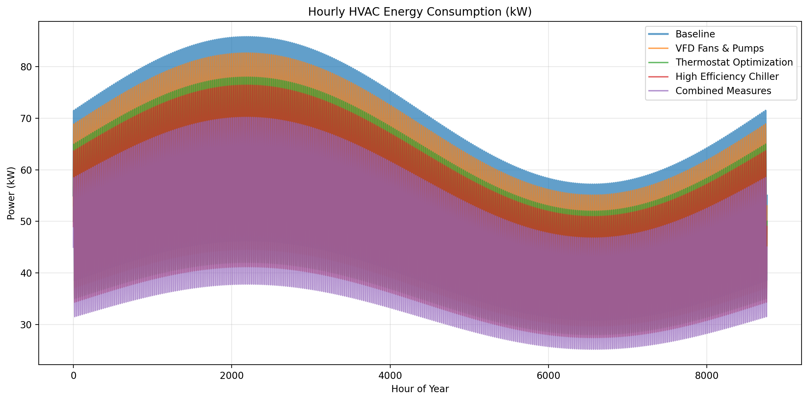
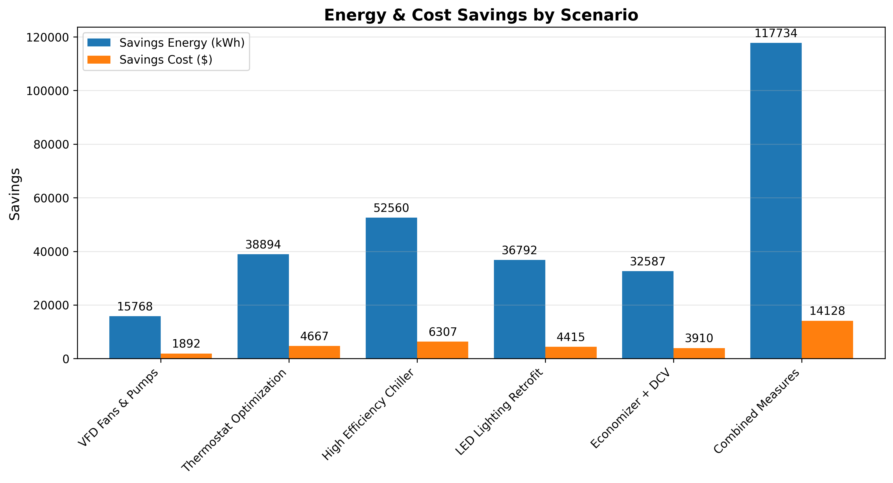

# HVAC System Optimization & Energy Simulation Tool

**Python-based framework** for modeling annual HVAC energy consumption, operating costs, and CO₂ emissions in a commercial building. Evaluates multiple efficiency upgrade scenarios and provides clear engineering insights with visualizations and ROI analysis.

This project demonstrates practical simulation skills: realistic load modeling, modular system design, scenario analysis, and data-driven decision making — core competencies for mechanical, energy, and systems engineering roles.




## Features
- Realistic hourly load profile generation tailored to Ottawa climate (daily + seasonal patterns)
- Modular, object-oriented HVAC component modeling
- Baseline vs. four efficiency upgrade scenarios
- Energy, cost, and CO₂ emissions calculations
- Simple payback period (ROI) analysis
- High-quality automated visualizations with saved outputs

## Technologies
- **Python 3**
- NumPy, Pandas, Matplotlib
- Object-oriented design

## Results (Latest Simulation)

| Scenario                    | Annual Energy (kWh) | Annual Cost ($) | Savings (kWh) | Savings ($) | ROI (years) | CO₂ Reduction (tons) |
|-----------------------------|---------------------|-----------------|---------------|-------------|-------------|----------------------|
| **Baseline**                | 313,170             | 37,580          | -             | -           | -           | -                    |
| VFD Fans & Pumps            | 301,782             | 36,214          | 11,388        | 1,367       | 36.6        | 5.7                  |
| Thermostat Optimization     | 284,700             | 34,164          | 28,470        | 3,416       | 14.6        | 14.2                 |
| High Efficiency Chiller     | 279,006             | 33,481          | 34,164        | 4,100       | 12.2        | 17.1                 |
| **Combined Measures**       | **256,230**         | **30,748**      | **56,940**    | **6,833**   | **7.3**     | **28.5**             |

*Assumes $50,000 capital investment for ROI calculations. Results generated from `main.py`.*

## Getting Started

```bash
git clone https://github.com/ZMatrix253/HVAC_Optimization_Project.git
cd HVAC_Optimization_Project

# Create virtual environment
python3 -m venv venv
source venv/bin/activate        # On macOS

pip install numpy pandas matplotlib

# Run the simulation
python main.py
